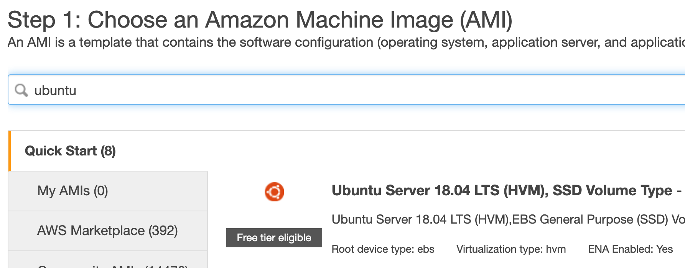
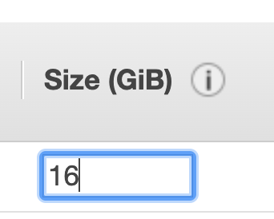
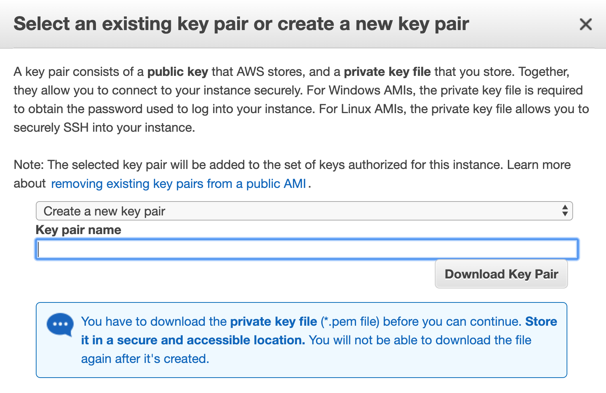
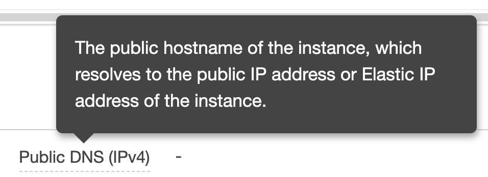
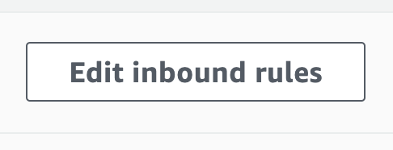

This guide uses AWS, but other clouds that support GPU resources should
more or less have a similar flow.

We will use a g4dn.xlarge instance which will cost \~\$0.7 including
storage cost.

1\. Login to your AWS account (if you don\'t have any account - make
one. You will be asked for a credit card). You will start in the N
Virginia region (us-east-1), this should be fine.

2\. In the top left, select Services then search for EC2 and click.

3\. Select the orange Launch Instance button and the \"Launch Instance\"
from the drop-down.

4\. Locate the search field in the new page and search for \"ubuntu\".

5\. You should see search results like the following:

{width="6.5in"
height="2.5416666666666665in"}

6\. Click the blue Select button on the right side of the Ubuntu 18.04
image.

7\. Find the All Instance Types drop down and click it - then choose GPU
Instances to filter the list.

8\. Click the box next to the g4dn.xlarge option (You must have vCPU
capacity in order to use this instance. type - if you get to the end of
this process and an error message from Amazon says you only have 0 vCPU
available - you\'re literally going to have to open a support request to
have them increase this limit - that process might take 12 hours for
them to respond fully - just follow their link to open a support case
and say \"I want 4 vCPU\" and wait).

9\. Click Next: Configure Instance Details

10\. Leave everything on this screen at defaults unless you know what
you want to change and why.

11\. Click Next: Add Storage

12\. Change the size of the volume to at least 16 GB:

{width="3.5625in"
height="2.8541666666666665in"}

13\. Click Review and Launch.

14\. You will see a page about your instance not being eligible for free
tier - this is fine. Click Launch.

15\. You will see a window about SSH keys - select new keypair, give the
key a name (any name is fine) and click the accept box. The SSH pem key
file will download to your machine.

{width="6.5in"
height="4.222222222222222in"}

16\. Click Launch.

17\. It will take less than a minute for your instance to be up. You\'ll
see a Public DNS address with the hostname of your instance:

{width="6.5in"
height="2.361111111111111in"}

18\. You can copy the hostname by clicking the two little squares that
appear at the end when you mouse over it (you can highlight the whole
thing and cmd & c it also, but the icon is convenient!)

19\. You can now SSH into that machine (do not forget to chmod 400
your_pem_file.pem because AWS won\'t allow you to SSH in with open
permissions)

20\. Here is a list of commands to run against the machine to get it
going - you will be prompted at certain points (Continue? \[Y/n\] type
stuff). Make sure you run the commands one at a time and agree to the
prompts when necessary. The Amazon Guide for installing NVIDIA drivers
provides a good explanation.

21\. You\'ll need to add an IAM user to this EC2 instance in order to
copy the NVIDIA driver files from AWS S3 to your machine. For that
you\'ll also need the aws cli installed. These commands are in the GIST
above, but what they don\'t cover is actually creating the IAM user
It\'s fairly straight forward to aws configure once you have the aws cli
installed and add the access key and secret key for your IAM user.

22\. Lastly - you\'ll need to allow TCP and UDP from your IP Address to
your EC2 instance:

{width="6.5in"
height="0.3888888888888889in"}

23\. Click the Launch Wizard link in your instance, then click the
Security Group listed - with it\'s long random ID.

24\. Finally click on Edit Inbound Rules

{width="5.0625in"
height="1.9375in"}

25\. You\'ll need to add a rule for TCP 5556 where the IP is My IP and
Amazon will automatically find your IP address if you select this.
Personally I opened all TCP and UDP from my IP to keep it simple - but
you only need the single port above.
